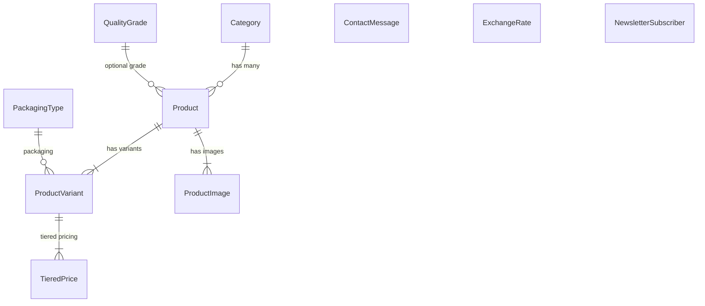

# 📋 خلاصه پروژه Palace Karimi و مراحل دیپلوی روی VPS

---

## ۱. خلاصه پروژه

**Palace Karimi** یک پلتفرم B2B صادرات زعفران و پسته ایرانی است که با Django 5.2 ساخته شده.

### 🏗️ معماری فنی

| بخش | تکنولوژی |
|---|---|
| **بک‌اند** | Django 5.2 + Gunicorn |
| **دیتابیس** | PostgreSQL 16 |
| **فرانت‌اند** | Bootstrap 4 + jQuery + Porto Theme (سفارشی‌شده) |
| **زیرساخت** | Docker + Nginx + python-dotenv |
| **چندزبانگی** | ۴ زبان: فارسی (RTL)، انگلیسی، عربی، ترکی |

### 📦 اپلیکیشن‌ها

| اپ | توضیح |
|---|---|
| **`catalog`** | اپ اصلی — محصولات، دسته‌بندی، قیمت‌گذاری پلکانی، تماس با ما، خبرنامه |
| **`core`** | میدلور سفارشی (Permissions-Policy header) — بقیه کدها خالی و بلااستفاده |
| **`config`** | تنظیمات اصلی Django |

### 📊 مدل‌های دیتابیس



- **Category** — دسته‌بندی محصولات (ترجمه‌پذیر)
- **QualityGrade** — درجه کیفی (ترجمه‌پذیر)
- **PackagingType** — نوع بسته‌بندی (ترجمه‌پذیر)
- **Product** — محصول اصلی با UUID، SEO fields، ترجمه‌پذیر
- **ProductVariant** — تنوع محصول (وزن، بسته‌بندی، SKU، حداقل سفارش)
- **TieredPrice** — قیمت‌گذاری پلکانی (بر اساس تعداد سفارش)
- **ProductImage** — تصاویر با تبدیل خودکار به WebP و ریسایز
- **ContactMessage** — پیام‌های تماس با ما (با ثبت IP و User-Agent)
- **ExchangeRate** — نرخ ارزها (دلار، یورو، درهم، لیر، ریال)
- **NewsletterSubscriber** — مشترکین خبرنامه

### 🔒 ویژگی‌های امنیتی موجود
- ✅ Rate Limiting روی فرم تماس (۵/ساعت) و خبرنامه (۳/دقیقه)
- ✅ HSTS + SSL Redirect در حالت Production
- ✅ CSRF Protection
- ✅ Security Headers (X-Frame-Options, X-Content-Type-Options, XSS-Protection)
- ✅ Non-root Docker user
- ✅ اجرای Secret Key اجباری در Production
- ✅ محدودیت آپلود (20MB در Nginx)

### 🌐 صفحات سایت
- صفحه اصلی (`/`) — دسته‌بندی‌ها + ۴ محصول آخر
- فروشگاه (`/shop/`) — کاتالوگ محصولات با صفحه‌بندی
- جزئیات محصول (`/product/<slug>/`) — تصاویر + قیمت‌گذاری پلکانی + محصولات مرتبط
- جزئیات دسته‌بندی (`/category/<slug>/`) — محصولات هر دسته
- درباره ما (`/about/`)
- تماس با ما (`/contact/`) — فرم با Rate Limiting
- شرایط و سوالات (`/terms/`)
- خبرنامه (POST endpoint)
- Sitemap XML + robots.txt

### 🐳 زیرساخت Docker موجود

```
Internet → Nginx (80/443) → Gunicorn (8000) → Django → PostgreSQL
```

- **Dockerfile**: Multi-stage build، Non-root user، Python 3.12-slim
- **docker-compose.yml**: ۳ سرویس (db + web + nginx) با health check
- **entrypoint.sh**: صبر برای DB → migrate → cache table → collectstatic → Gunicorn
- **nginx/default.conf**: Gzip، Security Headers، Cache Static/Media، Health Check
- **backup.sh**: بکاپ‌گیری خودکار با حفظ ۳۰ بکاپ آخر

---

## ۲. مراحل دیپلوی روی VPS (قدم به قدم)

### مرحله ۱: آماده‌سازی VPS

```bash
# آپدیت سیستم (Ubuntu/Debian)
sudo apt update && sudo apt upgrade -y

# نصب Docker و Docker Compose
sudo apt install -y docker.io docker-compose-plugin
sudo systemctl enable docker
sudo systemctl start docker

# اضافه کردن یوزر به گروه docker (اختیاری)
sudo usermod -aG docker $USER
```

### مرحله ۲: انتقال پروژه به VPS

```bash
# روش ۱: از Git (ترجیحی)
git clone <آدرس ریپوزیتوری شما> /opt/palace_karimi
cd /opt/palace_karimi

# روش ۲: از طریق SCP (اگر Git ندارید)
scp -r ./Palce_Karimi_v1 user@YOUR_VPS_IP:/opt/palace_karimi
```

### مرحله ۳: تنظیم فایل `.env`

```bash
cd /opt/palace_karimi
cp .env.example .env
nano .env
```

> [!IMPORTANT]
> مقادیر زیر را حتماً تغییر دهید:

```env
SECRET_KEY=یک-کلید-تصادفی-خیلی-طولانی-و-امن
DEBUG=False
ALLOWED_HOSTS=yourdomain.com,www.yourdomain.com
CSRF_TRUSTED_ORIGINS=https://yourdomain.com,https://www.yourdomain.com
DB_HOST=db
DB_PORT=5432
DB_PASSWORD=یک-رمز-عبور-قوی-برای-دیتابیس
```

> [!TIP]
> برای تولید Secret Key:
> ```bash
> python3 -c "from django.core.management.utils import get_random_secret_key; print(get_random_secret_key())"
> ```

### مرحله ۴: تنظیم دامنه و DNS
- یک دامنه بخرید (مثلاً از Namecheap یا نیک‌سرور)
- رکورد **A** دامنه را به IP سرور VPS ست کنید
- رکورد **A** برای `www` هم تنظیم کنید

### مرحله ۵: تنظیم Nginx (دامنه خود)

فایل [nginx/default.conf](file:///d:/Project/Palce_Karimi_v1/nginx/default.conf) را ویرایش کنید:

```nginx
server_name yourdomain.com www.yourdomain.com;   # ← دامنه واقعی
```

### مرحله ۶: بیلد و اجرای Docker

```bash
# بیلد کردن image ها
docker compose build

# اجرای کانتینرها در پس‌زمینه
docker compose up -d

# بررسی وضعیت
docker compose ps
docker compose logs web
docker compose logs nginx
```

### مرحله ۷: تنظیم SSL (HTTPS) با Let's Encrypt

> [!WARNING]
> بدون SSL سایت شما ناامن است و مرورگرها هشدار می‌دهند!

```bash
# نصب Certbot
sudo apt install -y certbot

# گرفتن گواهینامه (Nginx باید روی پورت 80 در حال اجرا باشد)
sudo certbot certonly --webroot -w /var/www/html -d yourdomain.com -d www.yourdomain.com
```

سپس باید:
1. Volume گواهینامه‌ها را به `docker-compose.yml` اضافه کنید
2. بلاک HTTPS را در `nginx/default.conf` فعال (uncomment) کنید
3. ریدایرکت HTTP → HTTPS را فعال کنید

### مرحله ۸: بکاپ خودکار

```bash
# اسکریپت بکاپ را اجرایی کنید
chmod +x backup.sh

# تنظیم cron job برای بکاپ روزانه
crontab -e
# اضافه کنید:
0 3 * * * cd /opt/palace_karimi && ./backup.sh >> /var/log/palace_backup.log 2>&1
```

### مرحله ۹: تأیید عملکرد

```bash
# بررسی پاسخ سایت
curl http://yourdomain.com/fa/

# بررسی لاگ‌ها
docker compose logs -f web
docker compose logs -f nginx
```

---

## ۳. کارهای باقی‌مانده برای تکمیل پروژه

### 🔴 اولویت بالا (ضروری قبل از لانچ)

| # | کار | وضعیت | توضیح |
|---|---|---|---|
| 1 | **SSL/HTTPS** | ❌ | گواهینامه Let's Encrypt + تنظیم Nginx HTTPS |
| 2 | **دامنه واقعی** | ❌ | خرید دامنه و تنظیم DNS |
| 3 | **وارد کردن داده واقعی** | ❌ | محصولات، تصاویر، قیمت‌ها و ترجمه‌ها |
| 4 | **تست کامل ترجمه‌ها** | ❌ | بررسی ترجمه‌های عربی و ترکی |
| 5 | **`ALLOWED_HOSTS` و `CSRF_TRUSTED_ORIGINS`** | ❌ | تنظیم با دامنه واقعی در `.env` |

### 🟡 اولویت متوسط (بعد از لانچ اولیه)

| # | کار | توضیح |
|---|---|---|
| 6 | **Superuser ساخته شود** | `python manage.py createsuperuser` داخل کانتینر |
| 7 | **مانیتورینگ** | Uptime Robot یا مشابه برای اطلاع از downtime |
| 8 | **فایروال** | `ufw allow 80,443/tcp` و بستن بقیه پورت‌ها |
| 9 | **Fail2ban** | جلوگیری از حملات brute-force |
| 10 | **تست لود** | بررسی عملکرد با ترافیک بالا |

### 🟢 اولویت پایین (بهبود آینده)

| # | کار | توضیح |
|---|---|---|
| 11 | **اپ `core` خالی** | حذف یا استفاده از آن (فقط یک Middleware دارد) |
| 12 | **Redis به جای DB Cache** | بهبود عملکرد Rate Limiting |
| 13 | **CDN** | Cloudflare یا آروان‌کلاد برای سرعت بیشتر |
| 14 | **ایمیل نوتیفیکیشن** | ارسال ایمیل وقتی پیام تماس جدید ثبت شد |
| 15 | **گزارش آنالیتیکس** | Google Analytics یا Plausible |
| 16 | **API (اختیاری)** | Django REST Framework برای اپ موبایل |

---

## ۴. چک‌لیست سریع دیپلوی

```
☐ VPS خریداری و آماده شده (Ubuntu 22.04+ پیشنهادی)
☐ Docker و Docker Compose نصب شده
☐ پروژه به VPS منتقل شده (git clone)
☐ فایل .env با مقادیر واقعی تنظیم شده
☐ دامنه خریداری و DNS تنظیم شده
☐ nginx/default.conf با دامنه واقعی آپدیت شده
☐ docker compose build && docker compose up -d اجرا شده
☐ سایت از طریق HTTP قابل دسترس است
☐ SSL با Let's Encrypt تنظیم شده
☐ ریدایرکت HTTP → HTTPS فعال شده
☐ Superuser ساخته شده
☐ داده‌های واقعی از پنل ادمین وارد شده
☐ بکاپ خودکار (cron) تنظیم شده
☐ فایروال (ufw) تنظیم شده
```

> [!NOTE]
> پروژه شما از نظر **معماری و زیرساخت Docker کاملاً آماده دیپلوی** است. فایل‌های Dockerfile، docker-compose.yml، entrypoint.sh و nginx/default.conf همگی به درستی نوشته شده‌اند. فقط نیاز به تنظیمات محیطی (دامنه، SSL، داده واقعی) دارید.
