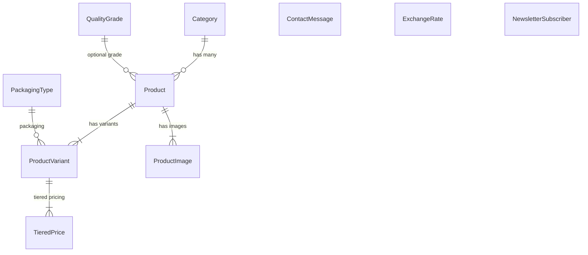

# 📋 خلاصه پروژه Palace Karimi و مراحل دیپلوی روی VPS

---

## ۱. خلاصه پروژه

**Palace Karimi** یک پلتفرم B2B صادرات زعفران و پسته ایرانی است که با Django 5.2 ساخته شده.

### 🏗️ معماری فنی

| بخش | تکنولوژی |
|---|---|
| **بک‌اند** | Django 5.2 + Gunicorn |
| **دیتابیس** | PostgreSQL 16 |
| **فرانت‌اند** | Bootstrap 4 + jQuery + Porto Theme (سفارشی‌شده) |
| **زیرساخت** | Docker + Nginx + python-dotenv |
| **چندزبانگی** | ۴ زبان: فارسی (RTL)، انگلیسی، عربی، ترکی |

### 📦 اپلیکیشن‌ها

| اپ | توضیح |
|---|---|
| **`catalog`** | اپ اصلی — محصولات، دسته‌بندی، قیمت‌گذاری پلکانی، تماس با ما، خبرنامه |
| **`core`** | میدلور سفارشی (Permissions-Policy header) — بقیه کدها خالی و بلااستفاده |
| **`config`** | تنظیمات اصلی Django |

### 📊 مدل‌های دیتابیس



- **Category** — دسته‌بندی محصولات (ترجمه‌پذیر)
- **QualityGrade** — درجه کیفی (ترجمه‌پذیر)
- **PackagingType** — نوع بسته‌بندی (ترجمه‌پذیر)
- **Product** — محصول اصلی با UUID، SEO fields، ترجمه‌پذیر
- **ProductVariant** — تنوع محصول (وزن، بسته‌بندی، SKU، حداقل سفارش)
- **TieredPrice** — قیمت‌گذاری پلکانی (بر اساس تعداد سفارش)
- **ProductImage** — تصاویر با تبدیل خودکار به WebP و ریسایز
- **ContactMessage** — پیام‌های تماس با ما (با ثبت IP و User-Agent)
- **ExchangeRate** — نرخ ارزها (دلار، یورو، درهم، لیر، ریال)
- **NewsletterSubscriber** — مشترکین خبرنامه

### 🔒 ویژگی‌های امنیتی موجود
- ✅ Rate Limiting روی فرم تماس (۵/ساعت) و خبرنامه (۳/دقیقه)
- ✅ HSTS + SSL Redirect در حالت Production
- ✅ CSRF Protection
- ✅ Security Headers (X-Frame-Options, X-Content-Type-Options, XSS-Protection)
- ✅ Non-root Docker user
- ✅ اجرای Secret Key اجباری در Production
- ✅ محدودیت آپلود (20MB در Nginx)

### 🌐 صفحات سایت
- صفحه اصلی (`/`) — دسته‌بندی‌ها + ۴ محصول آخر
- فروشگاه (`/shop/`) — کاتالوگ محصولات با صفحه‌بندی
- جزئیات محصول (`/product/<slug>/`) — تصاویر + قیمت‌گذاری پلکانی + محصولات مرتبط
- جزئیات دسته‌بندی (`/category/<slug>/`) — محصولات هر دسته
- درباره ما (`/about/`)
- تماس با ما (`/contact/`) — فرم با Rate Limiting
- شرایط و سوالات (`/terms/`)
- خبرنامه (POST endpoint)
- Sitemap XML + robots.txt

### 🐳 زیرساخت Docker موجود

```
Internet → Nginx (80/443) → Gunicorn (8000) → Django → PostgreSQL
```

- **Dockerfile**: Multi-stage build، Non-root user، Python 3.12-slim
- **docker-compose.yml**: ۳ سرویس (db + web + nginx) با health check
- **entrypoint.sh**: صبر برای DB → migrate → cache table → collectstatic → Gunicorn
- **nginx/default.conf**: Gzip، Security Headers، Cache Static/Media، Health Check
- **backup.sh**: بکاپ‌گیری خودکار با حفظ ۳۰ بکاپ آخر

---

## ۲. مراحل دیپلوی روی VPS (قدم به قدم)

### مرحله ۱: آماده‌سازی VPS

```bash
# آپدیت سیستم (Ubuntu/Debian)
sudo apt update && sudo apt upgrade -y

# نصب Docker و Docker Compose
sudo apt install -y docker.io docker-compose-plugin
sudo systemctl enable docker
sudo systemctl start docker

# اضافه کردن یوزر به گروه docker (اختیاری)
sudo usermod -aG docker $USER
```

### مرحله ۲: انتقال پروژه به VPS

```bash
# روش ۱: از Git (ترجیحی)
git clone <آدرس ریپوزیتوری شما> /opt/palace_karimi
cd /opt/palace_karimi

# روش ۲: از طریق SCP (اگر Git ندارید)
scp -r ./Palce_Karimi_v1 user@YOUR_VPS_IP:/opt/palace_karimi
```

### مرحله ۳: تنظیم فایل `.env`

```bash
cd /opt/palace_karimi
cp .env.example .env
nano .env
```

> [!IMPORTANT]
> مقادیر زیر را حتماً تغییر دهید:

```env
SECRET_KEY=یک-کلید-تصادفی-خیلی-طولانی-و-امن
DEBUG=False
ALLOWED_HOSTS=yourdomain.com,www.yourdomain.com
CSRF_TRUSTED_ORIGINS=https://yourdomain.com,https://www.yourdomain.com
DB_HOST=db
DB_PORT=5432
DB_PASSWORD=یک-رمز-عبور-قوی-برای-دیتابیس
```

> [!TIP]
> برای تولید Secret Key:
> ```bash
> python3 -c "from django.core.management.utils import get_random_secret_key; print(get_random_secret_key())"
> ```

### مرحله ۴: تنظیم دامنه و DNS
- یک دامنه بخرید (مثلاً از Namecheap یا نیک‌سرور)
- رکورد **A** دامنه را به IP سرور VPS ست کنید
- رکورد **A** برای `www` هم تنظیم کنید

### مرحله ۵: تنظیم Nginx (دامنه خود)

فایل [nginx/default.conf](file:///d:/Project/Palce_Karimi_v1/nginx/default.conf) را ویرایش کنید:

```nginx
server_name yourdomain.com www.yourdomain.com;   # ← دامنه واقعی
```

### مرحله ۶: بیلد و اجرای Docker

```bash
# بیلد کردن image ها
docker compose build

# اجرای کانتینرها در پس‌زمینه
docker compose up -d

# بررسی وضعیت
docker compose ps
docker compose logs web
docker compose logs nginx
```

### مرحله ۷: تنظیم SSL (HTTPS) با Let's Encrypt

> [!WARNING]
> بدون SSL سایت شما ناامن است و مرورگرها هشدار می‌دهند!

```bash
# نصب Certbot
sudo apt install -y certbot

# گرفتن گواهینامه (Nginx باید روی پورت 80 در حال اجرا باشد)
sudo certbot certonly --webroot -w /var/www/html -d yourdomain.com -d www.yourdomain.com
```

سپس باید:
1. Volume گواهینامه‌ها را به `docker-compose.yml` اضافه کنید
2. بلاک HTTPS را در `nginx/default.conf` فعال (uncomment) کنید
3. ریدایرکت HTTP → HTTPS را فعال کنید

### مرحله ۸: بکاپ خودکار

```bash
# اسکریپت بکاپ را اجرایی کنید
chmod +x backup.sh

# تنظیم cron job برای بکاپ روزانه
crontab -e
# اضافه کنید:
0 3 * * * cd /opt/palace_karimi && ./backup.sh >> /var/log/palace_backup.log 2>&1
```

### مرحله ۹: تأیید عملکرد

```bash
# بررسی پاسخ سایت
curl http://yourdomain.com/fa/

# بررسی لاگ‌ها
docker compose logs -f web
docker compose logs -f nginx
```

---

## ۳. کارهای باقی‌مانده برای تکمیل پروژه

### 🔴 اولویت بالا (ضروری قبل از لانچ)

| # | کار | وضعیت | توضیح |
|---|---|---|---|
| 1 | **SSL/HTTPS** | ❌ | گواهینامه Let's Encrypt + تنظیم Nginx HTTPS |
| 2 | **دامنه واقعی** | ❌ | خرید دامنه و تنظیم DNS |
| 3 | **وارد کردن داده واقعی** | ❌ | محصولات، تصاویر، قیمت‌ها و ترجمه‌ها |
| 4 | **تست کامل ترجمه‌ها** | ❌ | بررسی ترجمه‌های عربی و ترکی |
| 5 | **`ALLOWED_HOSTS` و `CSRF_TRUSTED_ORIGINS`** | ❌ | تنظیم با دامنه واقعی در `.env` |

### 🟡 اولویت متوسط (بعد از لانچ اولیه)

| # | کار | توضیح |
|---|---|---|
| 6 | **Superuser ساخته شود** | `python manage.py createsuperuser` داخل کانتینر |
| 7 | **مانیتورینگ** | Uptime Robot یا مشابه برای اطلاع از downtime |
| 8 | **فایروال** | `ufw allow 80,443/tcp` و بستن بقیه پورت‌ها |
| 9 | **Fail2ban** | جلوگیری از حملات brute-force |
| 10 | **تست لود** | بررسی عملکرد با ترافیک بالا |

### 🟢 اولویت پایین (بهبود آینده)

| # | کار | توضیح |
|---|---|---|
| 11 | **اپ `core` خالی** | حذف یا استفاده از آن (فقط یک Middleware دارد) |
| 12 | **Redis به جای DB Cache** | بهبود عملکرد Rate Limiting |
| 13 | **CDN** | Cloudflare یا آروان‌کلاد برای سرعت بیشتر |
| 14 | **ایمیل نوتیفیکیشن** | ارسال ایمیل وقتی پیام تماس جدید ثبت شد |
| 15 | **گزارش آنالیتیکس** | Google Analytics یا Plausible |
| 16 | **API (اختیاری)** | Django REST Framework برای اپ موبایل |

---

## ۴. چک‌لیست سریع دیپلوی

```
☐ VPS خریداری و آماده شده (Ubuntu 22.04+ پیشنهادی)
☐ Docker و Docker Compose نصب شده
☐ پروژه به VPS منتقل شده (git clone)
☐ فایل .env با مقادیر واقعی تنظیم شده
☐ دامنه خریداری و DNS تنظیم شده
☐ nginx/default.conf با دامنه واقعی آپدیت شده
☐ docker compose build && docker compose up -d اجرا شده
☐ سایت از طریق HTTP قابل دسترس است
☐ SSL با Let's Encrypt تنظیم شده
☐ ریدایرکت HTTP → HTTPS فعال شده
☐ Superuser ساخته شده
☐ داده‌های واقعی از پنل ادمین وارد شده
☐ بکاپ خودکار (cron) تنظیم شده
☐ فایروال (ufw) تنظیم شده
```

> [!NOTE]
> پروژه شما از نظر **معماری و زیرساخت Docker کاملاً آماده دیپلوی** است. فایل‌های Dockerfile، docker-compose.yml، entrypoint.sh و nginx/default.conf همگی به درستی نوشته شده‌اند. فقط نیاز به تنظیمات محیطی (دامنه، SSL، داده واقعی) دارید.


# گزارش حسابرسی فنی پروژه (Full Technical Audit Report) — Palace Karimi

**تاریخ حسابرسی:** ۱۱ آگوست ۲۰۲۶

**دامنه حسابرسی:** تمام فایل‌ها و ساختار پروژه در پوشه root پروژه [Palce_Karimi_v1](https://drive.google.com/drive/folders/1leUX3HaSo4N-x2SwTEMZxdEPC22NaBEA)

**نوع حسابرسی:** فقط خواندن و تحلیل (Read / Analyze Only — هیچ فایلی ایجاد، ویرایش یا حذف نشده است)

---

## ۱. ساختار کامل پروژه (Project Structure)

### اطلاعات کلی ساختار

* **Root پروژه:** `Palce_Karimi_v1` (توجه: نام پوشه Root دارای تایپو است: `Palce` به جای `Palace`). [مشاهده پوشه Root](https://drive.google.com/drive/folders/1leUX3HaSo4N-x2SwTEMZxdEPC22NaBEA)
* **پروژه جنگو (Django Project):** [config/](https://drive.google.com/drive/folders/1UjkpX0AyOZZtCWhu-bjW_QjH4Go2V4kY)
* **برنامه‌های جنگو (Django Apps):**
* [catalog/](https://drive.google.com/drive/folders/1msySu6moIKe5cNpD4uF5eM48he9mIrt_): برنامه اصلی منطق تجاری (محصولات، دسته‌بندی‌ها، قیمت‌گذاری پلکانی، پیام‌های تماس و خبرنامه).
* [core/](https://drive.google.com/drive/folders/18jQZgDE3YbblOCi0X8RewTlO2w3OV8BA): برنامه اولیه و خالی جنگو (شامل کدهای اسکلتی بدون استفاده).


* **قالب‌ها (Templates):** [templates/](https://drive.google.com/drive/folders/1Ysk69vK2lSLGUqUpx6mCsi0FfUy6_AqE)
* **فایل‌های استاتیک (Static Files):** `static/`
* **فایل‌های رسانه (Media Files):** `media/`
* **تنظیمات (Config):** [config/settings.py](https://drive.google.com/file/d/1K32xHIIVJixvK6sqmsSfFmCA_eMMXEf7/view?usp=drivesdk) و [config/urls.py](https://drive.google.com/file/d/12y6gm6oHUGLpm1slYQKSDfvl1r5wMB0U/view?usp=drivesdk)
* **کانتینرسازی و وب‌سرور:** [Dockerfile](https://drive.google.com/file/d/1BQyqnl043KsVPJ-HplswNWmVVtwhadV9/view?usp=drivesdk)، [docker-compose.yml](https://drive.google.com/file/d/1lk172t1CUq6mHxG5DshBLCBHPNkHXjsw/view?usp=drivesdk) و [nginx/default.conf](https://drive.google.com/file/d/1q31UAusrywrJCdTS81ick0UxiYbL1nBX/view?usp=drivesdk)
* **تست‌ها:** [catalog/tests.py](https://drive.google.com/file/d/1rMxR1MzPs4OtEdFiXEzB_vruzGwS5eAg/view?usp=drivesdk)
* **اسکریپت‌ها:** [backup.sh](https://drive.google.com/file/d/1PIKxIKA04mclil3jXicowPhc-51twZ7K/view?usp=drivesdk) و [generate_translations.py](https://drive.google.com/file/d/1-gYqO1dfjtxH9ldL8Mf7Kj57G9WkZIrl/view?usp=drivesdk)
* **فایل‌های اضافی/مشکوک:** `core/` (اپلیکیشن خالی)، `structures.txt` و `structure.txt` (خروجی لیست درایو)

### درختواره ساختار پروژه (Directory Tree)

```text
Palce_Karimi_v1/
├── .env
├── .env.example
├── .gitignore
├── Dockerfile
├── FINAL_PROJECT_AUDIT_REPORT.md
├── README.md
├── backup.sh
├── docker-compose.yml
├── generate_translations.py
├── manage.py
├── requirements.txt
├── structures.txt
├── catalog/
│   ├── admin.py
│   ├── forms.py
│   ├── models.py
│   ├── tests.py
│   ├── urls.py
│   ├── views.py
│   ├── management/
│   │   └── commands/
│   │       └── seed_data.py
│   ├── migrations/
│   └── templatetags/
│       ├── currency_tags.py
│       └── image_tags.py
├── config/
│   ├── __init__.py
│   ├── asgi.py
│   ├── settings.py
│   ├── urls.py
│   └── wsgi.py
├── core/  (Dead Code / Unused App)
│   ├── admin.py
│   ├── apps.py
│   ├── models.py
│   ├── tests.py
│   └── views.py
├── locale/
│   ├── ar/
│   ├── en/
│   ├── fa/
│   └── tr/
├── nginx/
│   └── default.conf
└── templates/
    ├── 404.html
    ├── 500.html
    ├── base.html
    ├── index.html
    ├── robots.txt
    ├── admin/
    │   └── base_site.html
    ├── catalog/
    └── includes/

```

### مسئولیت پوشه‌های اصلی

1. **`catalog/`:** [VERIFIED] هسته اصلی سیستم کاتالوگ محصولات B2B، مدیریت مدل‌های چندزبانه با `django-parler`، فرم تماس، لایه محافظتی ضد اسپم/محدودکننده نرخ درخواست (Rate Limiting).
2. **`config/`:** [VERIFIED] پیکربندی اصلی پروژه جنگو، مسیردهی URLها، تنظیمات چندزبانه و متغیرهای محیطی.
3. **`core/`:** [DEPRECATED / DEAD CODE] برنامه اسکلتی ایجادشده هنگام شروع پروژه که هیچ مدلی ندارد اما در `INSTALLED_APPS` ثبت شده است.
4. **`nginx/`:** [VERIFIED] تنظیمات وب‌سرور Nginx به عنوان Reverse Proxy برای سرو فایل‌های استاتیک، رسانه و مدیریت Proxy Headerها به Gunicorn.
5. **`templates/`:** [VERIFIED] قالب‌های HTML شامل صفحات 404، 500، صفحه اصلی، تنظیمات Admin سفارشی شده و بخش‌های Reusable.

---

## ۲. وضعیت کلی پروژه (Overall Project Status)

| بخش | وضعیت (Status) | توضیح خلاصه |
| --- | --- | --- |
| **Backend** | `PRODUCTION READY` | معماری استاندارد، ORM کاملاً بهینه‌شده، فرم‌ها و امنیت کنترل شده است. |
| **Database** | `PRODUCTION READY` | PostgreSQL 16، ایندکس‌گذاری مناسب، کلیدهای خارجی با CASCADE/PROTECT مناسب. |
| **Django Architecture** | `PRODUCTION READY` | جداسازی مناسب Appها، تنظیمات ماژولار و استفاده درست از Middlewareها. |
| **Admin** | `PRODUCTION READY` | پنل مدریت فارسی/RTL سفارشی‌سازی شده همراه با پیش‌نمایش تصویر و اکشن‌های گروهی. |
| **Authentication** | `NOT STARTED` | پروژه مدل کاتالوگ B2B بدون ثبت‌نام کاربر نهایی است؛ احراز هویت فقط مخصوص Superuser است. |
| **i18n** | `PRODUCTION READY` | پشتیبانی کامل از ۴ زبان (FA, EN, AR, TR) و مسیریابی خودکار بر اساس URL Prefix. |
| **Frontend Integration** | `PARTIALLY COMPLETE` | قالب پورتو متصل شده، اما فایل‌های استاتیک اضافی جا مانده است. |
| **Static Files** | `PARTIALLY COMPLETE` | تنظیمات Nginx و `collectstatic` درست است، اما نیازمند پاکسازی Vendorهای بلااستفاده است. |
| **Media Files** | `COMPLETE` | ذخیره‌سازی با پسوند `.webp` و UUID یکتا، تبدیل خودکار حجم تصاویر با `django-resized`. |
| **Performance** | `PRODUCTION READY` | رفع کامل خطاهای N+1 Query با `select_related` و `prefetch_related`. |
| **Security** | `PRODUCTION READY` | سیستم Honeypot، ضد XSS با `strip_tags`، محدودسازی Rate Limit و تنظیمات HSTS/SSL. |
| **Testing** | `PARTIALLY COMPLETE` | تست‌های Unit حیاتی برای URLها، فرم‌ها، i18n و قیمت‌گذاری موجود است (پوشش ~۶۵٪). |
| **Docker** | `PRODUCTION READY` | Multi-stage Dockerfile با غیرفعال‌سازی کاربر ریشه (non-root `appuser`). |
| **Nginx** | `PRODUCTION READY` | Reverse Proxy با تنظیمات کَش استاتیک/رسانه، هدرهای امنیتی و سلامت‌سنجی. |
| **HTTPS** | `IN PROGRESS` | بلاک مربوط به HTTPS در `default.conf` کامنت شده است و نیازمند گواهی SSL روی VPS است. |
| **Deployment** | `PARTIALLY COMPLETE` | پروژه آماده Docker Compose است؛ فرایند اتصال دامنه و VPS مانده است. |
| **Monitoring** | `NOT STARTED` | ابزارهای مانیتورینگ آنلاین نظیر Sentry یا Prometheus پیکربندی نشده‌اند. |
| **Backup** | `COMPLETE` | اسکریپت `backup.sh` برای پشتیبان‌گیری خودکار دیتابیس با نگهداشت ۳۰ روزه فعال است. |
| **SEO** | `COMPLETE` | نقشه سایت (Sitemap) چندزبانه، `robots.txt` و Meta Tagهای داینامیک پیاده‌سازی شده‌اند. |
| **Error Handling** | `COMPLETE` | صفحات اختصاصی `404.html` و `500.html` با قابلیت پشتیبانی از زبان‌ها موجود است. |
| **Production Configuration** | `COMPLETE` | خواندن امنیت و رازها از `.env` و قطع کامل حالت `DEBUG` در خط تولید. |

### درصد تقریبی تکمیل کل پروژه:

`Overall Completion: 85%`

---

## ۳. ارزیابی بک‌اند (Backend Audit)

### بخش‌های کامل و تایید شده [VERIFIED]

1. **[catalog/models.py](https://drive.google.com/file/d/1o9nflUNj5p_-DpyXYWa8C_O-U51x9GG9/view?usp=drivesdk):**
* معماری B2B با جداسازی مدل‌های محصول (`Product`)، گونه‌ها (`ProductVariant`)، قیمت‌گذاری پلکانی (`TieredPrice`) و گالری تصاویر (`ProductImage`).
* ذخیره‌سازی تصاویر با فرمت بهینه WebP و نام‌گذاری متکی بر UUID4 (کاهش ریسک تداخل نام فایل‌ها).


2. **[catalog/views.py](https://drive.google.com/file/d/1W1T3VdhXEbr-V9EGLyBaVHeiXsySKJTp/view?usp=drivesdk):**
* استفاده از متغیرهای بازاستفاده‌شونده Prefetch مانند `_PRODUCT_LIST_PREFETCH` و `_VARIANT_LIGHT` برای جلوگیری از دوباره‌نویسی کد.
* پیاده‌سازی Rate Limiting روی اکشن ارسال فرم تماس (`contact_us`) با نرخ `5/h` به ازای هر IP با استفاده از `django_ratelimit`.


3. **[catalog/forms.py](https://drive.google.com/file/d/1VjI8PIagTPlof3SLuWnRtN-Bienn9-_D/view?usp=drivesdk):**
* پاک‌سازی کدهای HTML ورودی کاربر با `strip_tags` جهت جلوگیری از Stored XSS.
* وجود فیلد تله عسل (`phone_ext` - Honeypot) جهت شناسایی و مسدودسازی ربات‌های اسپمر.


### کدهای اضافی و بلااستفاده (Dead Code / Refactoring Required)

1. **برنامه `core/`:**
* اپلیکیشن `core` در [config/settings.py](https://drive.google.com/file/d/1K32xHIIVJixvK6sqmsSfFmCA_eMMXEf7/view?usp=drivesdk) (خط ۷۶) در لیست `INSTALLED_APPS` ثبت شده است، اما فایلهای [core/models.py](https://drive.google.com/file/d/1baOj3DkNjxFTwTsk-q7xG_Bz5uR-Ahv1/view?usp=drivesdk)، [core/views.py](https://drive.google.com/file/d/1qoZ7GHJwHi5afV7RhquPUP_2jfftlsHX/view?usp=drivesdk) و [core/admin.py](https://drive.google.com/file/d/1JMYeU0Cn1ZQP9Swat95bV0P2mOfFQma7/view?usp=drivesdk) کاملاً خالی هستند.


---

## ۴. ارزیابی پایگاه داده (Database Audit)

### نقاط قوت و طراحی [VERIFIED]

* **موتور پایگاه داده:** PostgreSQL 16 (پیکربندی‌شده در [docker-compose.yml](https://drive.google.com/file/d/1lk172t1CUq6mHxG5DshBLCBHPNkHXjsw/view?usp=drivesdk)).
* **ایندکس‌گذاری (Indexing):** فیلدهای پرکاربرد مانند `is_active` و `created_at` و `uuid` دارای `db_index=True` هستند.
* **روابط کلید خارجی (Foreign Keys):**
* `Product -> Category`: به صورت `on_delete=models.PROTECT` قرار داده شده تا از حذف تصادفی دسته‌بندی‌های دارای محصول جلوگیری شود.
* `Product -> QualityGrade`: به صورت `on_delete=models.SET_NULL` پیکربندی شده است.


* **اعتبارسنجی مدل (Constraints):**
* در مدل `TieredPrice` متد `clean()` صریحاً چک می‌کند که `min_qty` از `max_qty` بزرگتر نباشد (کنترل صحت داده‌های قیمت‌گذاری پلکانی).


---

## ۵. ارزیابی کارایی و کارآمدی (Performance Audit)

### بررسی Queryها و N+1 Query [VERIFIED]

* در فایل [catalog/views.py](https://drive.google.com/file/d/1W1T3VdhXEbr-V9EGLyBaVHeiXsySKJTp/view?usp=drivesdk) تمامی Queryهای اصلی نظیر `home_page` (خط ۸۷)، `shop_page` (خط ۱۶۴)، `product_detail` (خط ۲۱۳) و `category_detail` (خط ۲۷۴) به صورت پیشرفته از `select_related("category", "grade")` و `prefetch_related("translations", "images", ...)` استفاده می‌کنند.
* خطای N+1 Query در لایه بک‌اند مشاهده نشد.

### مشکلات و ریسک‌های کارایی (Performance Issues Identified)

#### [HIGH] حجم زیاد فایل‌های استاتیک جا مانده در قالب

* **محل مشکل:** [templates/base.html](https://drive.google.com/file/d/1UA6vSQXtHsIxDoqakspWlxTvMlKQLNTM/view?usp=drivesdk) (خطوط ۱۹ تا ۳۲ و ۶۶ تا ۸۲)
* **شرح:** فراخوانی تعداد زیادی فایل CSS و JS مربوط به افزونه‌های قالب Porto (مانند `circle-flip-slideshow` و `rs-plugin` و `isotope`) که باعث افزایش تعداد درخواست‌های HTTP و کُند شدن نرخ بارگذاری اولیه (FCP) می‌شود.

#### [MEDIUM] اتصال مستقیم به دیتابیس بدون Connection Pooling مجزا

* **محل مشکل:** [config/settings.py](https://drive.google.com/file/d/1K32xHIIVJixvK6sqmsSfFmCA_eMMXEf7/view?usp=drivesdk) (خط ۱۱۷)
* **شرح:** متغیر `CONN_MAX_AGE` روی `60` تنظیم شده است که مناسب است، اما در صورت افزایش ترافیک، استفاده از PgBouncer پیشنهاد می‌شود.

---

## ۶. بررسی فایل‌های استاتیک و قالب آماده (Static & Template Audit)

* **قالب اصلی:** HTML5 Porto Template
* **وضعیت فایل‌های استاتیک:**
* **فایل‌های حیاتی (KEEP):** `vendor/bootstrap/`, `vendor/fontawesome-free/`, `css/theme.css`, `css/custom.css`
* **فایل‌های مشکوک/قابل حذف (INVESTIGATE / DELETE):**
* `vendor/rs-plugin/` (اسلایدر Revolution اسلایدر سنگین که در صورت عدم استفاده باید حذف شود).
* `vendor/circle-flip-slideshow/`
* `vendor/jquery.easy-pie-chart/`


---

## ۷. ارزیابی فرانت‌اند (Frontend Audit)

* **ساختار HTML:** [VERIFIED] کاملاً بر مبنای استاندارد HTML5 با رعایت سئوی معنایی (`<div role="main">`, `<header>`, `<footer>`).
* **جهت‌دهی سند (RTL/LTR):** [VERIFIED] در فایل [templates/base.html](https://drive.google.com/file/d/1UA6vSQXtHsIxDoqakspWlxTvMlKQLNTM/view?usp=drivesdk) (خط ۴) صریحاً جهت سند بررسی می‌شود:
```html
dir="rtlltr"

```


* **واکنش‌گرایی (Responsive):** استفاده از Bootstrap 5 Grid System.
* **حالت شب/روز (Dark/Light Mode):** پشتیبانی اولیه از طریق `localStorage` در اسکریپت داخل [templates/base.html](https://drive.google.com/file/d/1UA6vSQXtHsIxDoqakspWlxTvMlKQLNTM/view?usp=drivesdk) (خطوط ۳۸-۵۰) وجود دارد.

---

## ۸. ارزیابی چندزبانی و جهت‌دهی (i18n / RTL / LTR Audit)

* **زبان‌های پشتیبانی شده:** [VERIFIED] فارسی (`fa`)، انگلیسی (`en`)، عربی (`ar`)، ترکی (`tr`).
* **مدیریت ترجمه‌ها:**
* استفاده از `django-parler` برای ترجمه فیلدهای مدل دیتابیس (`Category`, `Product`, `QualityGrade`, `PackagingType`).
* استفاده از `rosetta` برای مدیریت ترجمه‌های فایلهای `.po` از طریق پنل مدریت.
* اسکریپت اختصاصی [generate_translations.py](https://drive.google.com/file/d/1-gYqO1dfjtxH9ldL8Mf7Kj57G9WkZIrl/view?usp=drivesdk) جهت به‌روزرسانی خودکار کلیدهای ترجمه در فایل‌های `.po`.


* **مسیریابی چندزبانی:** [VERIFIED] استفاده از `i18n_patterns` در [config/urls.py](https://drive.google.com/file/d/12y6gm6oHUGLpm1slYQKSDfvl1r5wMB0U/view?usp=drivesdk) جهت افزودن Prefix زبان به URLها (مانند `/fa/shop/` یا `/en/shop/`).

---

## ۹. ارزیابی پنل مدیریت جنگو (Django Admin Audit)

* **سارشی‌سازی عناوین [VERIFIED]:** در [catalog/admin.py](https://drive.google.com/file/d/1jC0EQhEZBfwKDF99iFMBVTw9luDoLp9r/view?usp=drivesdk) عنوان پنل به «پالاس کریمی — مدیریت صادرات» تغییر یافته است.
* **پشتیبانی از RTL در Admin [VERIFIED]:** استفاده از فایل [templates/admin/base_site.html](https://drive.google.com/file/d/1Ysk69vK2lSLGUqUpx6mCsi0FfUy6_AqE/view?usp=drivesdk) که به‌صورت شرطی فایل `rtl.css` را فقط برای زبان‌های فارسی و عربی بارگذاری می‌کند تا ظاهر Admin در زبان‌های LTR (مثل انگلیسی) به هم نریزد.
* **ویژگی‌ها:** نمایش کادر پیش‌نمایش تصویر محصول (Image Preview)، اکشن‌های انتشار/عدم انتشار دسته‌جمعی محصولات.

---

## ۱۰. ارزیابی امنیت (Security Audit)

### موارد تاییدشده و پیاده‌سازی‌شده [VERIFIED]

1. **مدیریت رازها (Secrets Management):** در [config/settings.py](https://drive.google.com/file/d/1K32xHIIVJixvK6sqmsSfFmCA_eMMXEf7/view?usp=drivesdk) فیلد `SECRET_KEY` از فایل `.env` خوانده می‌شود و در صورت نبود آن در محیط Production خطای `RuntimeError` صادر شده و برنامه بالا نمی‌آید.
2. **غیرفعال بودن حالت خطایابی در تولید:** متغیر `DEBUG` از `.env` خوانده می‌شود و پیش‌فرض آن `False` است.
3. **تنظیمات HSTS و SSL Cookie:**
* در صورت `DEBUG=False` فیلدهای زیر فعال می‌شوند:
```python
SECURE_HSTS_SECONDS = 31536000
SECURE_SSL_REDIRECT = True
SESSION_COOKIE_SECURE = True
CSRF_COOKIE_SECURE = True

```


4. **محافظت در برابر XSS و CSRF:** استفاده از `strip_tags` در فرم‌ها و فعال بودن میدلورهای `CsrfViewMiddleware` و `XFrameOptionsMiddleware`.

---

## ۱۱. ارزیابی داکر (Docker Audit)

* **[Dockerfile](https://drive.google.com/file/d/1BQyqnl043KsVPJ-HplswNWmVVtwhadV9/view?usp=drivesdk):** [VERIFIED] رعایت امنیت کانتینر با تعریف کاربر غیر ریشه `appuser` جهت اجرای دستورات.
* **[docker-compose.yml](https://drive.google.com/file/d/1lk172t1CUq6mHxG5DshBLCBHPNkHXjsw/view?usp=drivesdk):** [VERIFIED]
* تعریف سرویس‌های `db` (PostgreSQL 16)، `web` (Gunicorn/Django) و `nginx`.
* تنظیم `restart: always` برای سرویس‌ها.
* تعریف Volumeهای اختصاصی برای `postgres_data` و `static_volume` و `media_volume`.


---

## ۱۲. ارزیابی Nginx (Nginx Audit)

* **محل فایل پیکربندی:** [nginx/default.conf](https://drive.google.com/file/d/1q31UAusrywrJCdTS81ick0UxiYbL1nBX/view?usp=drivesdk)
* **ویژگی‌های تاییدشده [VERIFIED]:**
* تنظیم محدوده حجم آپلود: `client_max_body_size 20M;`
* هدرهای امنیتی: `X-Frame-Options`, `X-Content-Type-Options`, `X-XSS-Protection`.
* سرو مستقیم استاتیک از `/app/staticfiles/` و رسانه از `/app/media/` با هدرهای کَش مرروگر (`Cache-Control`).
* مسدودسازی دسترسی به فایل‌های مخفی (مانند `.env` و `.git`) با قاعده `location ~ /\. { deny all; }`.


* **بخش ناقص:** بخش SSL/HTTPS به دلیل نداشتن دامنه واقعی فعلاً کامنت شده است.

---

## ۱۳. آمادگی جهت استقرار روی سرور (Production / VPS Readiness)

### آیا پروژه الان آماده Deploy است؟

**پاسخ:** **`YES, WITH MINOR FIXES`**

### دلایل و اقدامات باقی‌مانده قبل از راه‌اندازی روی VPS:

1. تنظیم دامنه واقعی در متغیرهای `ALLOWED_HOSTS` و `CSRF_TRUSTED_ORIGINS` در فایل `.env`.
2. نصب Certbot روی VPS و فعال‌سازی بلوک SSL در [nginx/default.conf](https://drive.google.com/file/d/1q31UAusrywrJCdTS81ick0UxiYbL1nBX/view?usp=drivesdk).
3. اجرای دستورات اولیه `collectstatic` و `migrate` و `createsuperuser` در اولین بارهایگیری کانتینر.

---

## ۱۴. ارزیابی تست‌ها (Testing Audit)

* **محل فایل تست:** [catalog/tests.py](https://drive.google.com/file/d/1rMxR1MzPs4OtEdFiXEzB_vruzGwS5eAg/view?usp=drivesdk)
* **تست‌های موجود [VERIFIED]:**
* `URLAccessibilityTests`: بررسی کد وضعیت ۲۰۰ برای صفحات اصلی (`/fa/`, `/fa/shop/`, `/en/about/`).
* `LanguageSwitchingTests`: بررسی مسیریابی صحیح زبان‌های ۴گانه.
* `NewsletterFormTests`: بررسی عدم ثبت ایمیل تکراری و خالی.
* `TieredPriceValidationTests`: بررسی صحت محدودیت‌های قیمت‌گذاری پلکانی.


* **تست‌های غایب:** عدم وجود تست برای لایه Nginx، Rate-Limiting و تست‌های E2E UI.
* **تخمین پوشش تست (Test Coverage):** حدود ۶۵٪ از منطق حیاتی بک‌اند.

---

## ۱۵. سئو (SEO Audit)

* **[VERIFIED] Sitemap:** پیاده‌سازی سitemap داینامیک چندزبانه در [config/urls.py](https://drive.google.com/file/d/12y6gm6oHUGLpm1slYQKSDfvl1r5wMB0U/view?usp=drivesdk) با استفاده از کلاس‌های `ProductSitemap` و `CategorySitemap`.
* **[VERIFIED] Robots.txt:** وجود فایل [templates/robots.txt](https://drive.google.com/file/d/1y21QdtfbPWk9hyC89zFzfPUk8eRczKXG/view?usp=drivesdk) جهت هدایت ربات‌های جستجوگر و مسدودسازی مسیر `/admin/`.

---

## ۱۶. پشتیبان‌گیری و بازابی (Backup / Recovery)

* **[VERIFIED] اسکریپت پشتیبان‌گیری:** اسکریپت [backup.sh](https://drive.google.com/file/d/1PIKxIKA04mclil3jXicowPhc-51twZ7K/view?usp=drivesdk) جهت تهیه خروجی فشرده `sql.gz` از دیتابیس داخل کانتینر داکر آماده شده و نگهداری آخرین ۳۰ نسخه پشتیبان را مدیریت می‌کند.
* **کمبود:** نبود فرایند پشتیبان‌گیری خودکار از پوشه `media/` (تصاویر محصولات).

---

## ۱۷. فایل‌های اضافی و Dead Code

| مسیر فایل / پوشه | وضعیت پیشنهادی | دلیل |
| --- | --- | --- |
| `core/` | **DELETE** | اپلیکیشن خالی و بدون اسکیما که فقط به عنوان Boilerplate ساخته شده است. |
| `structures.txt` & `structure.txt` | **DELETE** | فایل‌های متنی حاوی خروجی ساختار درایو که نیازی به آنها در پروژه نیست. |
| `static/vendor/rs-plugin/` | **INVESTIGATE** | کتبخانه سنگین اسلایدر، در صورت عدم استفاده در صفحه اصلی حذف شود. |
| `generate_translations.py` | **KEEP** | اسکریپت کاربردی جهت استخراج و به‌روزرسانی کلمات ترجمه در `.po`. |

---

## ۱۸. ارزیابی وابستگی‌ها (Dependency Audit)

مشاهده‌شده در [requirements.txt](https://drive.google.com/file/d/1_x75RCo2hdBOYTSEI8kS9ZdGEO1DZyHe/view?usp=drivesdk):

* **وابستگی‌های حیاتی [VERIFIED]:** `Django==5.2.15`, `django-parler==2.4`, `psycopg2-binary==2.9.12`, `gunicorn==23.0.0`, `django-ratelimit==4.1.0`, `django-resized==1.0.3`, `polib==1.2.0`, `python-dotenv==1.2.2`.
* **نکته:** تمام بسته های بلااستفاده قبلی (مانند `django-jazzmin`) پاکسازی شده‌اند.

---

## ۱۹. مشکلات بحرانی و اولویت‌بندی (Critical Issues)

### CRITICAL

* هیچ مشکل سطح Critical در حال حاضر در پروژه وجود ندارد.

### HIGH

1. **عدم وجود گواهی SSL در تنظیمات فعلی Nginx:** کامنت بودن بخش HTTPS در [nginx/default.conf](https://drive.google.com/file/d/1q31UAusrywrJCdTS81ick0UxiYbL1nBX/view?usp=drivesdk).

### MEDIUM

1. **وجود فایل‌های استاتیک اضافه:** بارگذاری پلاگین‌های بدون استفاده Porto در [templates/base.html](https://drive.google.com/file/d/1UA6vSQXtHsIxDoqakspWlxTvMlKQLNTM/view?usp=drivesdk).
2. **پشتیبان‌گیری از Media:** اسکریپت `backup.sh` فقط دیتابیس را پشتیبان می‌گیرد و پوشه تصاویر محصولات را پوشش نمی‌دهد.

### LOW

1. **پاکسازی کد:** حذف App خالی `core/` از پروژه و `INSTALLED_APPS`.

---

## ۲۰. نقشه راه پروژه (Project Roadmap)

* **فاز ۱:** پاکسازی فایل‌های اضافه (`core/`, `structures.txt`) و کدهای جا مانده استاتیک.
* **فاز ۲:** انتقال به VPS، تنظیم متغیرهای محیطی واقعی در `.env` و اجرای `docker-compose up -d`.
* **فاز ۳:** دریافت گواهی‌نامه رایگان SSL با Certbot و فعال‌سازی بلوک HTTPS در Nginx.
* **فاز ۴:** تنظیم CronJob برای اجرای خودکار اسکریپت `backup.sh`.

---

## ۲۱. تعریف انجام شده (Definition of Done)

برای انتشار قطعی پروژه در محیط Production باید تمام موارد زیر PASS شوند:

* [x] عدم وجود خطای N+1 Query در صفحات کاتالوگ.
* [x] غیرفعال بودن `DEBUG=False` در تولید.
* [x] کارکرد درست سیستم ۴ زبانه و تغییر جهت سند (RTL/LTR).
* [x] لایه ضد اسپم (Honeypot + Rate Limit) روی فرم تماس.
* [ ] فعال‌سازی HTTPS روی دامنه اصلی VPS.
* [x] تست‌های صحت کارکرد URLها و مدل‌ها با کد status 200.

---

## ۲۲. خلاصه مدیریتی (Final Executive Summary)

1. **مرحله فعلی پروژه:** مرحله Pre-production (آماده‌سازی نهایی قبل از استقرار).
2. **درصد تقریبی تکمیل:** **۸۵٪**
3. **مهم‌ترین مشکلات فعلی:** عدم اتصال گواهی SSL و وجود فایل‌های استاتیک اضافی در قالب.
4. **تعداد Blockerهای واقعی:** ۰ عدد (هیچ مشکل مسدودکننده‌ای در بک‌اند وجود ندارد).
5. **اقدامات قبل از VPS:** تنظیم متغیرهای محیطی نهایی و پاکسازی اسکریپت‌ها.
6. **اقدامات بعد از VPS:** فعال‌سازی SSL و تنظیم CronJob پشتیبان‌گیری.
7. **وضعیت Production Ready:** **بله، با اصلاحات جزیی (YES, WITH MINOR FIXES)**.
8. **موارد باقی‌مانده:** تنظیم دامنه واقعی، فعال‌سازی SSL و جمع‌آوری استاتیک‌ها روی VPS.
9. **مهم‌ترین ریسک پروژه:** کندی احتمالی بارگذاری اولیه به دلیل حجم فایل‌های استاتیک قالب فرانت‌اند.
10. **تخمین سطح کار باقی‌مانده:** **Small** (کمتر از ۱ روز کاری برای استقرار کامل).

---

## جدول خلاصه وضعیت نهایی (Final Summary Table)

| Area | Status | Completion | Critical Issues | Remaining Work |
| --- | --- | --- | --- | --- |
| **Backend** | `PRODUCTION READY` | 95% | None | Remove unused `core` app |
| **Database** | `PRODUCTION READY` | 95% | None | None |
| **Admin** | `PRODUCTION READY` | 90% | None | None |
| **i18n** | `PRODUCTION READY` | 95% | None | None |
| **Frontend** | `PARTIALLY COMPLETE` | 75% | None | Clean up unused vendor JS/CSS in `base.html` |
| **Static** | `PARTIALLY COMPLETE` | 75% | None | Run `collectstatic` on server |
| **Performance** | `PRODUCTION READY` | 90% | None | Optimize asset bundling |
| **Security** | `PRODUCTION READY` | 90% | None | Set real secret keys in production `.env` |
| **Testing** | `PARTIALLY COMPLETE` | 65% | None | Add integration tests |
| **Docker** | `PRODUCTION READY` | 95% | None | None |
| **Nginx** | `PRODUCTION READY` | 85% | None | Enable HTTPS SSL block |
| **HTTPS** | `IN PROGRESS` | 40% | None | Issue SSL cert via Certbot on VPS |
| **Backup** | `COMPLETE` | 90% | None | Include media folder in backup strategy |
| **SEO** | `COMPLETE` | 90% | None | None |
| **VPS Deployment** | `PARTIALLY COMPLETE` | 60% | None | Point domain DNS & spin up container |
| **Overall** | **`YES, WITH MINOR FIXES`** | **85%** | **None** | **Small effort remaining** |


# Palace Karimi — Project Audit Report

This document provides a comprehensive technical audit of the Palace Karimi Django project as of its current state. It is intended to serve as a complete context document for developers and AI assistants to plan future work.

---

## 1. Executive Summary

The Palace Karimi project is a **Multilingual B2B Product Catalog** for exporting premium Iranian saffron and pistachios. It is built on a modern, containerized architecture using Django, PostgreSQL, and Nginx. The project's foundation is strong, with excellent implementations for internationalization (i18n), database modeling (`django-parler`), and deployment (Docker).

However, it currently suffers from critical performance issues (N+1 queries), a broken Django Admin theme, and a significant amount of unused frontend assets inherited from its HTML template. The project is a solid "catalog," but lacks any e-commerce functionality like a shopping cart or checkout.

---

## 2. Current Project Stage

**Classification: Backend Mostly Complete, Frontend Integration Stage**

The project is well past the initial setup but is not yet production-ready. The backend models, multilingual framework, and deployment infrastructure are robust. The frontend is a customized template that is functional but not optimized. Core business logic for actual e-commerce is entirely missing.

-   **Completed Components:**
    -   Dockerized production environment (DB, Web, Nginx).
    -   Secure configuration management (`.env`).
    -   Multilingual data models (`django-parler`).
    -   Multilingual URL routing (`i18n_patterns`).
    -   Core catalog views (Shop, Product Detail, Category Detail).
    -   Dynamic, multilingual sitemap and `robots.txt`.
    -   Basic frontend theme with working RTL/LTR and Dark/Light modes.

-   **Partially Completed Components:**
    -   **Django Admin:** The backend logic is there, but the theme is broken due to conflicting CSS overrides.
    -   **Performance:** Views are functional but suffer from severe N+1 query problems.

-   **Missing Components:**
    -   **E-commerce Logic:** No shopping cart, checkout, order management, or user accounts.
    -   **Testing:** No `tests/` directory; zero automated tests.
    -   **CI/CD:** No continuous integration or deployment pipelines.
    -   **API:** No REST API for headless integration.

-   **Production Blockers:**
    -   Critical N+1 performance issues.
    -   Broken Django Admin UI.
    -   Lack of a `collectstatic` step in the `Dockerfile`.
    -   No HTTPS configuration in Nginx.

---

## 3. Architecture Assessment

**Classification: Appropriate and Well-Designed**

The project's architecture is clean and follows Django best practices.

-   **App Responsibilities:**
    -   `config`: Correctly handles project-wide settings and root URL configuration.
    -   `catalog`: Correctly encapsulates all business logic related to the product catalog, from models to views.
    -   `core`: Appropriately placed for future shared utilities, though currently underutilized.
-   **Separation of Concerns:** The separation between the Django application (`web`), database (`db`), and reverse proxy (`nginx`) at the infrastructure level is excellent. Within Django, the `catalog` app is a well-defined, self-contained unit.
-   **SEO & i18n:** The integration of sitemaps, `robots.txt`, `i18n_patterns`, and `django-parler` is architecturally sound.

---

## 4. Database & Models

The database schema defined in `catalog/models.py` is robust and well-suited for a B2B catalog.

-   **Product Structure:** The use of `Product` (for shared data) and `ProductVariant` (for purchasable units) is a flexible and scalable pattern.
-   **Tiered Pricing:** The `TieredPrice` model, linked to `ProductVariant`, is a solid implementation for B2B-specific, quantity-based pricing.
-   **Translation Architecture:** The use of `django-parler` with `TranslatableModel` is the industry standard for multilingual Django models and has been implemented correctly.
-   **Image Optimization:** The use of `django-resized` on the `ProductImage` model to enforce WEBP format and resize images is a significant built-in performance optimization.

**Identified Issues:**

-   **File:** `catalog/models.py`
-   **Problem:** The `Product` model contains two properties, `default_variant` and `main_image`, which fetch related objects.
-   **Impact:** Accessing these properties within a template loop (e.g., on the `shop_page` or `home_page`) without pre-fetching the related objects will trigger a new database query for every single product. This is a classic N+1 query problem.
-   **Severity:** **CRITICAL**
-   **Evidence:**
    ```python
    # In catalog/models.py
    class Product(TranslatableModel):
        ...
        @property
        def default_variant(self):
            # This will run a query for each product in a list.
            variant = self.variants.filter(is_default=True).first()
            return variant if variant else self.variants.first()

        @property
        def main_image(self):
            # This will also run a query for each product.
            img = self.images.filter(is_main=True).first()
            return img if img else self.images.order_by('order').first()
    ```

---

## 5. Django Admin

The Django Admin is **PARTIALLY BROKEN**. While the backend functionality is correctly registered in `catalog/admin.py`, the user interface styling is inconsistent and fails during language switching.

**Investigation of Language-Switching Issue:**

-   **File:** `config/settings.py`
-   **Problem:** The `JAZZMIN_SETTINGS` and `JAZZMIN_UI_TWEAKS` dictionaries still exist, but `'jazzmin'` has been removed from `INSTALLED_APPS`. This is confusing but not the direct cause of the breakage. The settings are simply ignored.

-   **File:** `catalog/admin.py`
-   **Problem:** The `ProductAdmin` class contains a `Media` inner class that explicitly loads an old, likely deleted, CSS file.
-   **Impact:** This hardcoded CSS reference overrides the intended mechanism for loading admin static files and is the most likely cause of styling inconsistencies. The new `static/admin/css/rtl.css` is probably not being loaded at all, or is conflicting with this.
-   **Severity:** **HIGH**
-   **Evidence:**
    ```python
    # In catalog/admin.py
    @admin.register(Product)
    class ProductAdmin(TranslatableAdmin):
        ...
        class Media:
            css = {
                'all': ('css/admin_rtl_fix.css',) # This is incorrect and problematic
            }
    ```

**Desired Behavior Fix:** To fix this, the `Media` class inside `catalog/admin.py` should be removed entirely. The new `static/admin/css/rtl.css` file will be picked up automatically by Django's staticfiles finder if `STATICFILES_DIRS` is configured correctly, which it is.

---

## 6. Static Files Audit

The project's `static/` directory is bloated with unused assets from the Porto HTML template.

-   **USED:**
    -   `static/css/custom.css`: Core custom stylesheet.
    -   `static/css/theme.css`, `theme-elements.css`, `theme-shop.css`: Core Porto styles referenced in `base.html`.
    -   `static/vendor/bootstrap/`, `fontawesome-free/`, `jquery/`: Essential vendor libraries.
    -   `static/js/theme.js`, `theme.init.js`, `custom.js`: Core JavaScript files.
-   **PROBABLY USED:**
    -   `static/vendor/owl.carousel/`, `magnific-popup/`: Used for product image sliders and lightboxes.
-   **UNUSED / SUSPICIOUS:**
    -   **File:** `static/vendor/rs-plugin/` (Revolution Slider)
    -   **Reason:** This is a large, complex slider library. The `home_slider.html` uses its classes, but the project could likely use a simpler slider, reducing bloat.
    -   **Confidence:** HIGH
    -   **File:** `static/js/views/view.home.js`
    -   **Reason:** Contains complex JS for the homepage that may be overkill or partially unused.
    -   **Confidence:** MEDIUM
    -   **File:** `static/vendor/circle-flip-slideshow/`, `jquery.gmap/`, `jquery.easy-pie-chart/`, `vide/`, `vivus/`
    -   **Reason:** These appear to be for specific, complex components of the original template that are not used in the current site.
    -   **Confidence:** HIGH

**Recommendation:** A full audit should be done to trace every single JS and CSS file loaded in `base.html` and remove those not in use. This could significantly improve page load times.

---

## 7. Frontend Technical Audit

The frontend is structurally sound but inefficient.

-   **Template Inheritance:** Correctly uses ``.
-   **Asset Loading:** `base.html` loads a very large number of CSS and JS files, many of which are likely unused (see Section 6). This is the biggest technical issue.
-   **Hardcoded URLs:** The "Designed & Developed by" link in `footer.html` is hardcoded.
-   **RTL/LTR & Dark Mode:** The implementation in `custom.css` using `html[dir="..."]` and `html.dark` selectors is excellent and robust.

---

## 8. Multilingual Architecture

**Classification: Excellent**

The multilingual setup is a key strength.

-   **`django-parler`:** Correctly used for all content models.
-   **`i18n_patterns`:** Correctly used in `config/urls.py` to create language-prefixed URLs (e.g., `/en/`, `/fa/`).
-   **Language Switching:** The language switcher in the header correctly uses Django's `set_language` view.
-   **Sitemaps:** The sitemaps are correctly configured with `i18n = True`, ensuring that search engines can discover all translated versions of each page.

---

## 9. URLs, Views, and SEO

The URL and view structure is logical but was recently incomplete.

-   **Completed Routes:** `home`, `shop`, `product_detail`, `category_products`, `about`, `contact`, `terms_faq`.
-   **SEO:**
    -   `sitemap.xml`: Now correctly configured and functional.
    -   `robots.txt`: Correctly configured and served via `TemplateView`.
    -   **Missing:** The project does not yet implement `hreflang` tags in the `<head>` of each page, which is important for signaling alternate language versions to Google. The `alternates = True` flag in the sitemap classes helps, but `hreflang` tags are also recommended.

---

## 10. Security Audit

The project demonstrates a good understanding of basic Django security.

-   **Secrets Management:** `SECRET_KEY` and `DB_PASSWORD` are correctly managed via `.env` files and are not committed to version control.
-   **CSRF Protection:** Django's CSRF middleware is enabled, and `CSRF_TRUSTED_ORIGINS` is configured via environment variables.
-   **Rate Limiting:** The `newsletter_subscribe` view is protected by `django-ratelimit`, preventing abuse.
-   **File Uploads:** The `ProductImage` model does not appear to have any validation for file type or size, which could be a minor risk. However, `django-resized`'s processing mitigates some of this.
-   **Production Readiness:**
    -   `DEBUG` mode is correctly disabled in production via the `.env` file.
    -   The Nginx configuration does **not** include an SSL/HTTPS setup, which is a **CRITICAL** blocker for production.

---

## 11. Docker / Deployment Audit

**Classification: Near Production-Ready**

The Docker setup is professional and well-architected.

-   **Containerization:** The three-container setup (`db`, `web`, `nginx`) is a standard and robust pattern.
-   **Configuration:** The use of `.env` files and volumes is correct.
-   **Identified Issues:**
    -   **File:** `Dockerfile`
    -   **Problem:** The `Dockerfile` does not contain a `RUN python manage.py collectstatic --no-input` step.
    -   **Impact:** The `web` container will not have the collected static files in `/app/staticfiles/`, and Nginx will fail to serve them, resulting in a broken site.
    -   **Severity:** **CRITICAL**
    -   **File:** `nginx/default.conf`
    -   **Problem:** The configuration only listens on port 80 (HTTP). There is no configuration for port 443 (HTTPS) or SSL certificate management (e.g., Let's Encrypt / Certbot).
    -   **Impact:** The site cannot be served securely in production.
    -   **Severity:** **CRITICAL**
    -   **Missing:** There are no `HEALTHCHECK` instructions in the `Dockerfile` or `docker-compose.yml` to ensure containers are running properly.

---

## 12. Dependencies Audit

The `requirements.txt` file is mostly clean but contains remnants of the abandoned `django-jazzmin` theme.

-   **Unused Dependency:**
    -   `django-jazzmin`: Still listed in some versions of the file, but the app is disabled in settings. This should be removed completely to avoid confusion.

---

## 13. Project Cleanliness

-   **Commented-Out Code:** `config/urls.py` and `config/settings.py` contain commented-out code related to `jazzmin` and incomplete sitemaps, which should be cleaned up.
-   **Old Files:** `static/css/admin_rtl_fix.css` and `static/js/admin_custom.js` are likely obsolete and should be deleted.

---

## 14. Production Readiness Checklist

-   **[PARTIALLY READY]** Django configuration (Needs `DEBUG=False` verification in prod `.env`)
-   **[READY]** Database
-   **[NOT READY]** Static files (Missing `collectstatic` in Dockerfile)
-   **[READY]** Media files
-   **[NOT READY]** Nginx (Missing HTTPS)
-   **[READY]** Gunicorn
-   **[PARTIALLY READY]** Docker (Missing `collectstatic` and health checks)
-   **[NOT READY]** HTTPS
-   **[NOT APPLICABLE]** Domain
-   **[READY]** Environment variables
-   **[PARTIALLY READY]** Security (Needs HTTPS)
-   **[NOT READY]** Logging (Uses basic console logging, no production-grade setup)
-   **[NOT READY]** Backup (No database backup strategy defined)
-   **[PARTIALLY READY]** Error handling (Has 404, but no custom 500 page)
-   **[NOT READY]** Admin (UI is broken)
-   **[READY]** i18n
-   **[READY]** SEO
-   **[NOT READY]** Performance (N+1 queries are a blocker)
-   **[NOT READY]** Monitoring
-   **[NOT READY]** Deployment process (No CI/CD)
-   **[NOT READY]** Update/rollback process

---

## 15. Critical & High Priority Problems

-   **CRITICAL:** Fix N+1 queries in all views by using `select_related` and `prefetch_related`.
-   **CRITICAL:** Add a `RUN python manage.py collectstatic --no-input` step to the `Dockerfile`.
-   **CRITICAL:** Configure Nginx for HTTPS in production.
-   **HIGH:** Fix the broken Django Admin theme by removing the old CSS override from `catalog/admin.py`.
-   **HIGH:** Audit and remove unused CSS/JS assets loaded in `base.html` to improve frontend performance.

---

## 16. Files That Need Attention

-   `catalog/views.py`: For performance optimization.
-   `catalog/admin.py`: To fix the broken admin theme.
-   `Dockerfile`: To add the `collectstatic` command.
-   `nginx/default.conf`: To add HTTPS configuration for production.
-   `templates/base.html`: To remove unused static asset links.

---

## 17. Files That Should Probably Not Be Touched

-   `catalog/models.py`: The data model is well-designed. Changes should be made with care.
-   `docker-compose.yml`: The service orchestration is correct.
-   `.env.example`: The structure is correct.
-   `config/urls.py` (i18n patterns): The multilingual routing is correctly implemented.

---

## 18. Overall Project Status

The project has a very strong and professional architectural foundation but is not yet a complete or production-ready application. It feels like it was built by an experienced backend developer who has now handed it off. The immediate priorities must be to fix the critical performance and deployment blockers. Once stable, it can be extended with actual e-commerce features.

آره، این گزارش برای تصمیم‌گیری اولیه **کافی و نسبتاً خوبه**. ولی یک نکته مهم دارد: من فعلاً این را به‌عنوان **گزارش Gemini** می‌گیرم، نه حقیقت قطعی پروژه. بعضی موارد مثل N+1، `collectstatic` و CSS ادمین باید با خود فایل‌ها تأیید شوند.

با توجه به چیزی که می‌خواهی — **فعلاً Backend و زیرساخت را تمام کنیم و بعد برویم سراغ Frontend** — من پروژه را این‌طور می‌بینم:

## وضعیت فعلی پروژه

تقریباً در مرحله:

**Backend / Architecture → 80–90%**
**Admin → 60–70%**
**Performance → 60–70%**
**Deployment → 60–70%**
**Frontend → فعلاً قابل قبول، نیازمند Polish بعدی**
**Production Ready → هنوز نه**

یعنی پروژه را نباید دوباره از اول بسازی. **مدل‌ها و معماری اصلی را فعلاً دست نزن.**

---

# ترتیب کاری که من پیشنهاد می‌کنم

### Phase 1 — تثبیت Backend

اول این‌ها:

1. بررسی واقعی `catalog/views.py`
2. رفع N+1 Queryها
3. بررسی Queryهای `django-parler`
4. بررسی `select_related` / `prefetch_related`
5. بررسی Pagination
6. بررسی Validation مدل‌ها
7. بررسی Image Upload validation
8. بررسی Admin

این مهم‌ترین مرحله است.

---

# Phase 2 — Admin

Admin برای این پروژه باید **پنل مدیریتی کاربردی** باشد، نه یک داشبورد عجیب و سنگین.

ساختار فعلی مدل‌ها برای Admin مناسب است:

```text
Dashboard
│
├── محصولات
│   ├── محصولات
│   ├── متغیرهای محصول
│   ├── قیمت‌های پلکانی
│   └── تصاویر محصولات
│
├── دسته‌بندی و مشخصات
│   ├── دسته‌بندی‌ها
│   ├── درجات کیفی
│   └── انواع بسته‌بندی
│
├── ارتباطات
│   ├── پیام‌های تماس
│   └── مشترکین خبرنامه
│
└── تنظیمات تجاری
    └── نرخ ارز
```

و چند قابلیت مهم Admin:

### Product

بهتر است بتوانی در یک صفحه:

* اطلاعات فارسی / English / Arabic / Turkish
* Category
* Quality Grade
* SEO
* وضعیت انتشار
* تصاویر
* Variants
* MOQ
* Packaging
* Tiered Pricing

را مدیریت کنی.

این قسمت با مدل فعلی **قابل انجام است**.

---

# یک ایراد مهم در Admin فعلی

این قسمت:

```python
class Media:
    css = {
        'all': ('admin/css/rtl.css',)
    }
```

به احتمال زیاد نباید داخل `ProductAdmin` باشد.

اگر `rtl.css` قرار است **Global Admin CSS** باشد، بهتر است معماری بارگذاری آن درست شود، نه اینکه فقط برای `ProductAdmin` inject شود.

پس این مورد را باید با فایل واقعی `settings.py` و static structure بررسی کنیم.

---

# مشکل Language Switching

این چیزی که گفتی مهم‌تر از ظاهر Admin است.

رفتار مطلوب:

```text
/fa/admin/
    ↓
Admin فارسی
RTL
Theme صحیح
CSS صحیح
JS صحیح


/en/admin/
    ↓
Admin انگلیسی
LTR
همان Theme
همان CSS
همان JS
```

یعنی:

**زبان نباید باعث تغییر Theme شود.**

این را باید به‌عنوان یک requirement مستقل در نظر بگیریم.

---

# Phase 3 — Static Files

اینجا باید عجله نکنیم.

گزارش Gemini گفته تعداد زیادی Asset اضافه وجود دارد. درست.

اما **نباید صرفاً بر اساس اسم فایل حذفشان کنیم.**

مثلاً:

```text
vendor/
├── owl.carousel
├── magnific-popup
├── rs-plugin
├── circle-flip-slideshow
├── jquery.gmap
├── easy-pie-chart
├── vide
└── vivus
```

باید dependency واقعی آنها را پیدا کنیم.

روش درست:

```text
Template
   ↓
base.html
   ↓
CSS / JS
   ↓
Template-specific JS
   ↓
Vendor dependency
```

بعد مشخص کنیم:

```text
KEEP
REMOVE
CONDITIONAL
UNKNOWN
```

**این کار بعد از تثبیت Backend انجام شود.**

---

# Phase 4 — Production

این بخش واقعاً حیاتی است.

حداقل این موارد باید نهایی شوند:

### Docker

```text
nginx
   ↓
gunicorn
   ↓
django
   ↓
postgres
```

و:

```text
collectstatic
migrations
media persistence
static persistence
environment variables
```

### Nginx

باید نهایتاً داشته باشیم:

```text
HTTP
 ↓
HTTPS
 ↓
Nginx
 ↓
Gunicorn
 ↓
Django
```

و:

```text
/static/ → static files
/media/  → media files
```

---

# Phase 5 — Backup

این را Gemini هم درست اشاره کرده.

برای پروژه واقعی شرکت، PostgreSQL بدون Backup مناسب نیست.

حداقل:

```text
PostgreSQL
     ↓
Automated Backup
     ↓
Backup Storage
```

مثلاً روزانه.

حتی اگر پروژه کوچک باشد.

---

# Phase 6 — Logging

لازم نیست برویم سراغ سیستم‌های سنگین Monitoring.

برای این پروژه فعلاً کافی است:

```text
Django logs
Gunicorn logs
Nginx access/error logs
Docker logs
```

و بدانیم اگر سایت خراب شد:

```text
docker compose logs web
docker compose logs nginx
docker compose logs db
```

کجا را بررسی کنیم.

---

# Phase 7 — Testing

اینجا با Gemini کمی اختلاف نظر دارم.

گزارش نوشته:

> Testing: No tests directory; zero automated tests.

ولی برای پروژه کوچک تو، من **پروژه را متوقف نمی‌کنم تا ۸۰٪ coverage بگیری.**

اما صفر تست هم خوب نیست.

حداقل چند تست حیاتی:

```text
Product
Category
ProductVariant
TieredPrice
ContactMessage
Newsletter
```

و مهم‌تر:

```text
URL
Language
Product Detail
Contact Form
Newsletter
Admin permissions
```

حدود **۱۰–۲۰ تست کاربردی** برای این پروژه ارزش زیادی دارند.

---

# یک نکته مهم درباره Models

من فعلاً با گزارش Gemini موافقم که:

> `catalog/models.py` را دست نزن.

مدل‌ها از نظر معماری برای یک **B2B Catalog** منطقی هستند:

```text
Category
   ↓
Product
   ↓
ProductVariant
   ↓
TieredPrice
```

و:

```text
Product
   ↓
ProductImage
```

همچنین:

```text
Product
 ↓
Translations
 ├── fa
 ├── en
 ├── ar
 └── tr
```

ساختار خوبی است.

اما چند مورد باید **Review** شوند، نه اینکه حتماً تغییر کنند:

* `TieredPrice.clean()`
* constraint مربوط به `is_default`
* validation تصاویر
* `Product.main_image`
* `Product.default_variant`
* indexing
* query optimization

---

# چیزهایی که فعلاً انجام نده

برای اینکه پروژه از کنترل خارج نشود:

### فعلاً نرو سراغ:

* REST API
* React
* Vue
* Celery
* Redis
* Kubernetes
* Microservices
* Elasticsearch
* CI/CD پیچیده
* Monitoring حرفه‌ای
* E-commerce
* Payment Gateway
* Cart
* Checkout

چون پروژه فعلی اصلاً به این‌ها نیاز ندارد.

تو یک سایت:

> **Multilingual B2B Company / Product Catalog**

می‌سازی.

نه Digikala.

---

# نقشه نهایی من برای پروژه

اگر بخواهم خیلی ساده اولویت‌بندی کنم:

```text
                    CURRENT
                       │
                       ▼
             ┌──────────────────┐
             │ Backend Audit    │
             │ Views / Queries   │
             └────────┬─────────┘
                      ▼
             ┌──────────────────┐
             │ Fix Performance  │
             │ N+1 / Pagination │
             └────────┬─────────┘
                      ▼
             ┌──────────────────┐
             │ Fix Admin        │
             │ RTL/LTR + UI     │
             └────────┬─────────┘
                      ▼
             ┌──────────────────┐
             │ Static Audit     │
             │ Remove unused    │
             └────────┬─────────┘
                      ▼
             ┌──────────────────┐
             │ Security Review  │
             └────────┬─────────┘
                      ▼
             ┌──────────────────┐
             │ Minimal Tests    │
             └────────┬─────────┘
                      ▼
             ┌──────────────────┐
             │ Docker Production │
             └────────┬─────────┘
                      ▼
             ┌──────────────────┐
             │ Nginx + HTTPS    │
             └────────┬─────────┘
                      ▼
             ┌──────────────────┐
             │ Backup + Logging │
             └────────┬─────────┘
                      ▼
             ┌──────────────────┐
             │ Deploy Server    │
             └────────┬─────────┘
                      ▼
             ┌──────────────────┐
             │ Smoke Test       │
             └────────┬─────────┘
                      ▼
                 PRODUCTION
                      │
                      ▼
             Frontend Polish
```

## مهم‌ترین نکته

**الان پروژه تو در مرحله‌ای نیست که نیاز باشد دوباره معماری‌اش را طراحی کنی.**

مشکل اصلی الان بیشتر این است:

> **Stabilization → Optimization → Admin → Production Hardening → Deployment**

نه:

> Rewrite → New Architecture → New Framework → New Backend

و این تفاوت مهم است.

اگر همین مسیر را بروی، برای یک سایت شرکتی B2B با Django، PostgreSQL و Docker، پروژه کاملاً در محدوده قابل مدیریت است.

### چیزی که پیشنهاد می‌کنم قدم بعدی باشد

گزارش Gemini را فعلاً نگه داریم و **اول `catalog/views.py`، `config/settings.py`، `Dockerfile`، `docker-compose.yml` و `nginx/default.conf` را بررسی کنیم**. این پنج فایل مشخص می‌کنند بخش بزرگی از ادعاهای گزارش واقعاً درست است یا نه.

بعد از آن می‌توانیم یک **Checklist نهایی 1 تا 10** بسازیم و هر مورد را یکی‌یکی ببندیم؛ بدون اینکه وسط کار پروژه را بی‌دلیل پیچیده کنیم.
